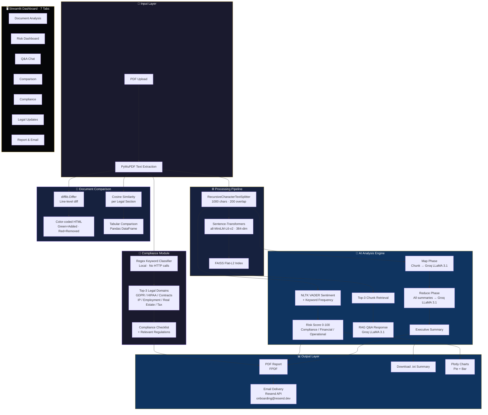
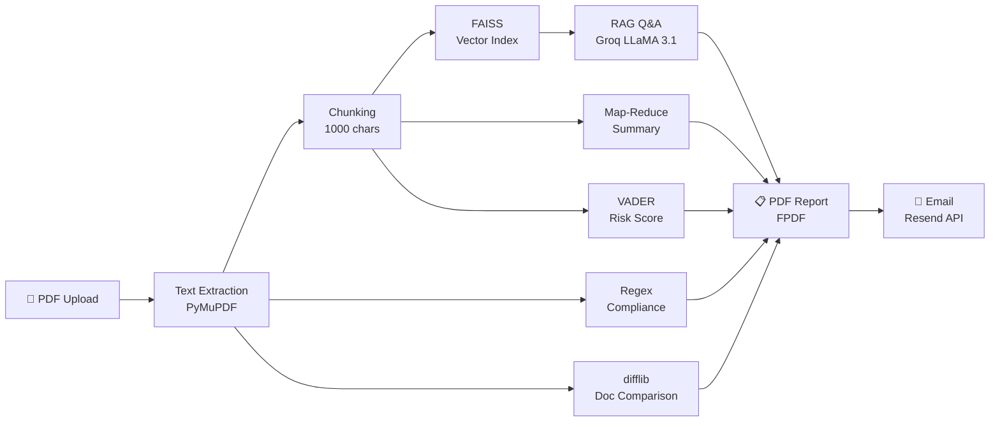

# Resume Content — LexAI: Legal Document Intelligence

## Resume Bullet Points

### Option A — Concise (3 bullets, for tight resume space)

**LexAI: AI-Powered Legal Document Summarization & Risk Assessment**
*LangChain · Groq LLM (LLaMA 3.1) · FAISS · Sentence-Transformers · Streamlit · Plotly · NLTK · Resend API*

- Built an end-to-end legal AI platform with a **Map-Reduce summarization pipeline** using **LangChain LCEL** and **Groq LLaMA 3.1**, processing 10K+ word contracts into structured executive summaries via a chunk→map→reduce architecture.

- Developed a **Retrieval-Augmented Generation (RAG) Q&A system** using **FAISS vector indexing** and **Sentence-Transformers (MiniLM-L6-v2)**, enabling hallucination-free natural language querying grounded exclusively in uploaded document content.

- Engineered an **NLTK VADER sentiment-based risk scoring engine** (Low/High/Critical), keyword-driven compliance classification across 7 regulatory domains (GDPR, HIPAA, Contracts, IP, Employment, Real Estate, Tax), and automated PDF/email delivery via **Resend API** — all served through a premium **Glassmorphism Streamlit dashboard**.

---

### Option B — Detailed (5 bullets, for project section)

**LexAI: AI-Powered Legal Document Intelligence Platform**
*LangChain · Groq API · LLaMA 3.1 · FAISS · Sentence-Transformers · Streamlit · PyMuPDF · NLTK · Plotly · Resend API*

- Architected a **Map-Reduce LLM pipeline** using **LangChain LCEL** (`ChatPromptTemplate | llm`) and **Groq LLaMA 3.1 8B**, splitting documents with `RecursiveCharacterTextSplitter` (1000-char chunks, 200-char overlap) and running parallel summarization before a final reduce step — enabling unlimited document length processing.

- Built a **RAG-based Q&A pipeline**: extracted text with **PyMuPDF**, embedded chunks into 384-dimensional vectors using **Sentence-Transformers (all-MiniLM-L6-v2)**, stored in a **FAISS Flat-L2 index**, and retrieved Top-3 semantically similar chunks to ground every LLM response — eliminating hallucination.

- Designed an **automated risk assessment engine** using **NLTK VADER** sentiment scoring combined with keyword frequency analysis across 3 risk categories (Compliance, Financial, Operational), producing a composite 0–100 risk score visualized with **Plotly** pie and bar charts.

- Implemented **multi-document comparison** using Python `difflib` for line-level diff (additions/deletions in color-coded HTML) plus **cosine similarity** between Sentence-Transformer embeddings of extracted legal sections (Termination, Indemnification, Governing Law, etc.) for semantic drift detection.

- Built a **local compliance classifier** using regex pattern matching across 7 legal domains, eliminating the latency of live web scraping; integrated **FPDF** for PDF report generation and **Resend API** for automated email delivery with base64-encoded attachments — all deployed as a 7-tab **Streamlit** dashboard with a premium custom CSS interface.

---

## Tech Stack Summary (for Skills Section)

| Category | Technologies |
|---|---|
| **LLM / AI** | LangChain LCEL, Groq API, LLaMA 3.1 8B, Map-Reduce, RAG |
| **NLP** | NLTK VADER Sentiment Analysis, Sentence-Transformers (MiniLM) |
| **Vector Database** | FAISS (Facebook AI Similarity Search) |
| **Document Processing** | PyMuPDF, RecursiveCharacterTextSplitter, difflib |
| **Frontend** | Streamlit, Plotly, Custom CSS (Glassmorphism) |
| **Backend / APIs** | Python, FPDF, Resend API, Regex pattern classification |
| **Architecture** | RAG Pipeline, Map-Reduce Summarization, Modular Python |

---

## Updated Architecture — Mermaid Diagram Code

Paste into [mermaid.live](https://mermaid.live/) to generate a clean diagram image.

### Detailed Architecture Diagram

### Simple Flowchart (for presentations)

